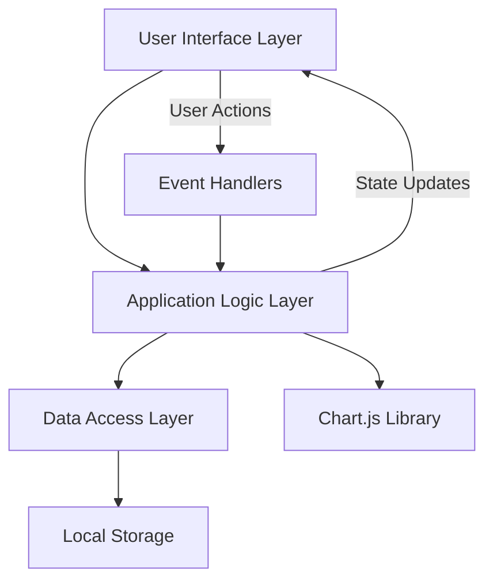
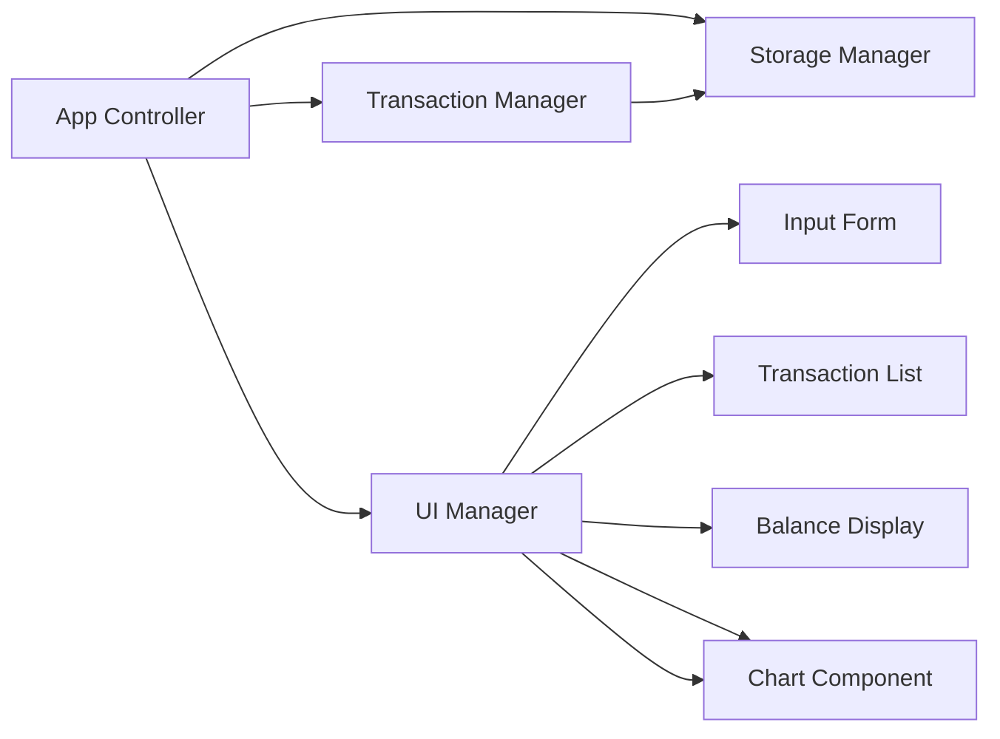
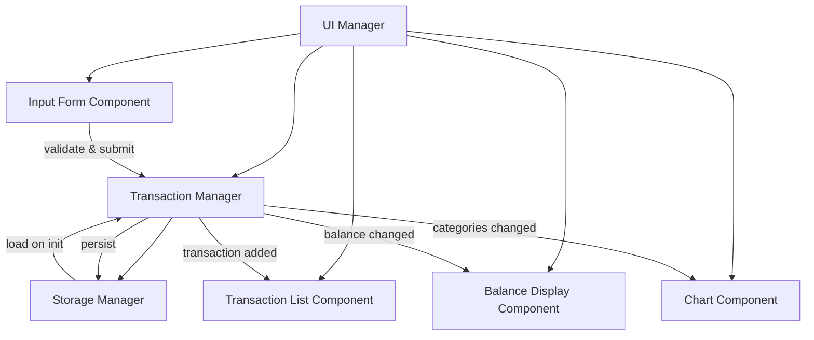
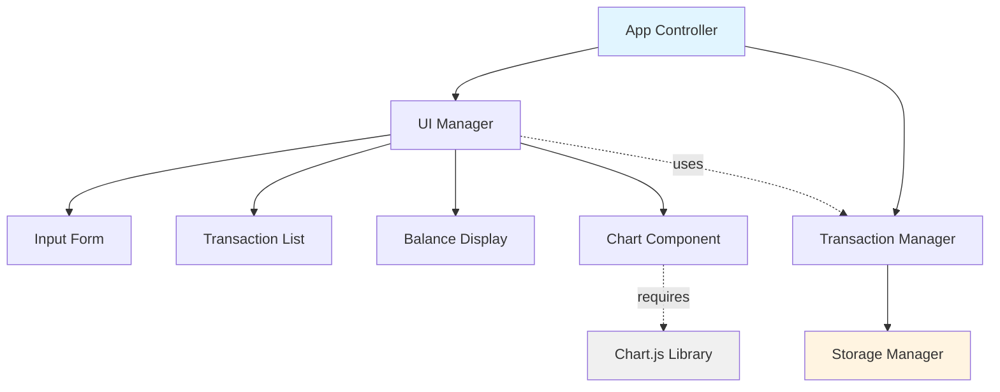
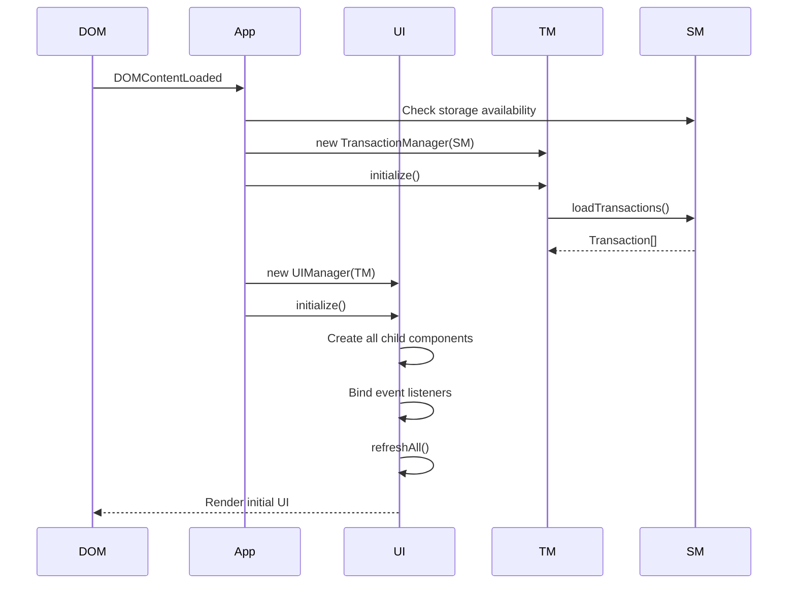
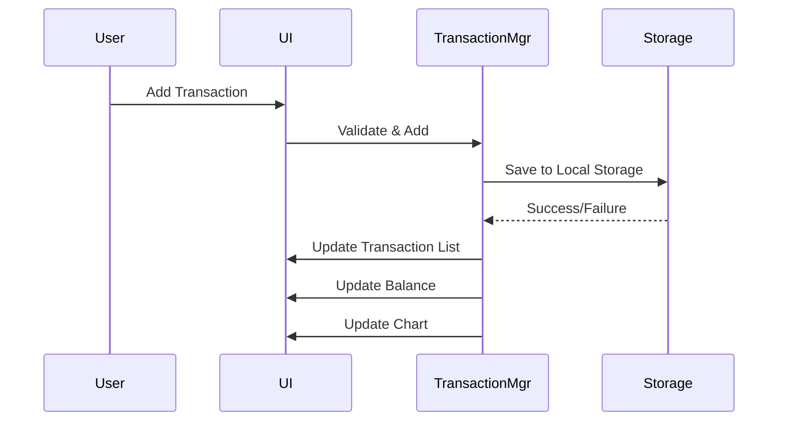

# Technical Design Document: Expense & Budget Visualizer

## Overview

The Expense & Budget Visualizer is a client-side web application that enables users to track expenses and visualize budget distribution across categories. The application operates entirely in the browser with no server dependencies, using Local Storage for data persistence and Chart.js for visualization.

### Core Objectives

1. Provide a simple interface for recording expenses with item name, amount, and category
2. Display all transactions in a scrollable list with delete functionality
3. Calculate and display total spending in real-time
4. Visualize spending distribution across categories using a pie chart
5. Persist all data locally in the browser
6. Maintain responsive performance with up to 1000 transactions

### Technology Stack

- **HTML5**: Semantic markup for structure
- **CSS3**: Styling with modern layout techniques (Flexbox/Grid)
- **Vanilla JavaScript (ES6+)**: Application logic without frameworks
- **Chart.js 4.x**: ([Official Documentation](https://www.chartjs.org/docs/latest/)) - Industry-standard charting library with ~60,000 GitHub stars and ~2.4M weekly npm downloads, providing canvas-based rendering for smooth performance
- **Local Storage API**: Browser-native persistence

### Key Design Principles

1. **Simplicity**: Single-page application with minimal dependencies
2. **Performance**: Efficient DOM updates and optimized chart rendering
3. **Maintainability**: Clear separation of concerns and modular code structure
4. **Reliability**: Robust error handling and data validation
5. **Accessibility**: WCAG AA compliant interface elements

## Architecture

### High-Level Architecture

The application follows a simple layered architecture with clear separation between data, business logic, and presentation:



### Component Structure



### Key Components

1. **App Controller**: Initializes the application, coordinates component interactions
2. **Storage Manager**: Handles all Local Storage operations with error handling
3. **Transaction Manager**: Manages transaction data, validation, and business logic
4. **UI Manager**: Coordinates UI updates and event binding
5. **Input Form Component**: Handles transaction input and validation
6. **Transaction List Component**: Renders and manages the transaction list
7. **Balance Display Component**: Calculates and displays total spending
8. **Chart Component**: Renders the pie chart using Chart.js

### File Structure

```
expense-budget-visualizer/
├── index.html              # Main HTML file
├── css/
│   └── styles.css         # All application styles
└── js/
    └── app.js             # All application logic
```

This structure satisfies Requirement 9 (Code Organization) with exactly one CSS file in css/ directory and one JavaScript file in js/ directory.

## Data Models

### Transaction Model

The core data structure representing a single expense:

```javascript
{
  id: string,           // Unique identifier (timestamp-based UUID)
  itemName: string,     // Item description (1-100 characters)
  amount: number,       // Expense amount in cents (integer: 1-99999999)
  category: string,     // Category enum: "Food" | "Transport" | "Fun"
  timestamp: number     // Unix timestamp (milliseconds)
}
```

### Storage Schema

**Key**: `expense-tracker-transactions`

**Value Structure**:
```javascript
{
  version: "1.0",                    // Schema version for future migrations
  transactions: Transaction[]        // Array of transaction objects
}
```

### Data Representation Strategy

To avoid floating-point precision issues in financial calculations (as documented in [Handling Currency Calculations](https://www.slingacademy.com/article/handling-precise-currency-calculations-with-javascripts-decimal-handling-tips/)), amounts are stored as **integers representing cents**:

- User enters: `$25.50`
- Stored as: `2550` (cents)
- Displayed as: `$25.50`

This approach ensures exact arithmetic operations without floating-point errors.

### Category Enumeration

```javascript
const CATEGORIES = {
  FOOD: "Food",
  TRANSPORT: "Transport",
  FUN: "Fun"
};
```

## Components and Interfaces

This section documents all component interfaces, their public APIs, method signatures, and interactions within the application architecture.

### Component Interaction Overview



### 1. Storage Manager Interface

**Purpose**: Provides abstraction layer for Local Storage operations with error handling and data validation.

**Dependencies**: None (uses browser Local Storage API)

**Public API**:

```typescript
class StorageManager {
  // Constants
  static readonly STORAGE_KEY: string = 'expense-tracker-transactions';
  static readonly SCHEMA_VERSION: string = '1.0';
  
  /**
   * Load all transactions from Local Storage
   * @returns Array of transactions, or null if storage is empty/corrupted
   * @throws Never throws - returns null on error and logs to console
   */
  static loadTransactions(): Transaction[] | null;
  
  /**
   * Save transactions array to Local Storage
   * @param transactions - Array of transaction objects to persist
   * @returns true if save succeeded, false if quota exceeded or storage disabled
   */
  static saveTransactions(transactions: Transaction[]): boolean;
  
  /**
   * Check if Local Storage is available in current browser
   * @returns true if storage can be used, false otherwise
   */
  static isStorageAvailable(): boolean;
  
  /**
   * Validate structure of data loaded from storage
   * @param data - Parsed JSON object from storage
   * @returns true if data has valid schema, false otherwise
   */
  static validateStoredData(data: any): boolean;
  
  /**
   * Clear all stored transactions (for testing/reset)
   * @returns true if cleared successfully
   */
  static clearStorage(): boolean;
}
```

**Data Flow**:
- **Input**: Transaction array (on save)
- **Output**: Transaction array or null (on load)
- **Side Effects**: Writes to/reads from `localStorage`

**Error Handling**:
- Returns `null` on load failure (corrupted data, parse error)
- Returns `false` on save failure (quota exceeded, storage disabled)
- Logs all errors to console with descriptive messages
- Never throws exceptions (graceful degradation)

---

### 2. Transaction Manager Interface

**Purpose**: Manages in-memory transaction data, validation, CRUD operations, and business logic calculations.

**Dependencies**: 
- `StorageManager` (for persistence)

**Public API**:

```typescript
class TransactionManager {
  // Private state
  private transactions: Transaction[];
  private storageManager: typeof StorageManager;
  
  /**
   * Constructor
   * @param storageManager - Storage manager dependency for persistence
   */
  constructor(storageManager: typeof StorageManager);
  
  /**
   * Initialize manager by loading transactions from storage
   * Should be called once on app startup
   * @returns void
   */
  initialize(): void;
  
  /**
   * Add new transaction with validation
   * @param itemName - Item description string
   * @param amountDollars - Amount in dollars (will be converted to cents)
   * @param category - Category enum value
   * @returns Transaction object if successful, null if validation fails
   */
  addTransaction(
    itemName: string, 
    amountDollars: number, 
    category: string
  ): Transaction | null;
  
  /**
   * Delete transaction by unique ID
   * @param id - Transaction ID to delete
   * @returns true if deleted, false if ID not found
   */
  deleteTransaction(id: string): boolean;
  
  /**
   * Get all transactions sorted by timestamp (newest first)
   * @returns Array of transactions (defensive copy)
   */
  getTransactions(): Transaction[];
  
  /**
   * Get transaction by ID
   * @param id - Transaction ID to find
   * @returns Transaction object or null if not found
   */
  getTransactionById(id: string): Transaction | null;
  
  /**
   * Calculate total spending across all transactions
   * @returns Total amount in cents
   */
  getTotalCents(): number;
  
  /**
   * Get spending totals grouped by category
   * @returns Array of {category, totalCents} objects
   */
  getCategoryTotals(): Array<{category: string, totalCents: number}>;
  
  /**
   * Get count of transactions
   * @returns Number of transactions
   */
  getTransactionCount(): number;
  
  /**
   * Validate transaction data without creating transaction
   * @param itemName - Item name to validate
   * @param amount - Amount to validate (in dollars)
   * @param category - Category to validate
   * @returns Validation result with errors object
   */
  static validateTransaction(
    itemName: string, 
    amount: number, 
    category: string
  ): ValidationResult;
  
  /**
   * Generate unique transaction ID
   * @returns UUID string based on timestamp and random value
   */
  static generateId(): string;
}

/**
 * Validation result structure
 */
interface ValidationResult {
  valid: boolean;
  errors: {
    itemName?: string;
    amount?: string;
    category?: string;
  };
}
```

**Data Flow**:
- **Input**: User-provided transaction data (strings, numbers)
- **Processing**: Validation → Conversion (dollars to cents) → Storage
- **Output**: Transaction objects, totals, aggregations
- **Side Effects**: Calls `StorageManager.saveTransactions()` on add/delete

**Validation Rules** (applied in `validateTransaction`):
- Item name: Must be non-empty after trimming, max 100 characters
- Amount: Must be 0.01-999,999.99, max 2 decimal places
- Category: Must be one of "Food", "Transport", "Fun"

---

### 3. UI Manager Interface

**Purpose**: Coordinates UI component lifecycle, event binding, and cross-component updates.

**Dependencies**:
- `TransactionManager` (for data operations)
- All UI component modules

**Public API**:

```typescript
class UIManager {
  // Private state
  private transactionManager: TransactionManager;
  private inputForm: InputFormComponent;
  private transactionList: TransactionListComponent;
  private balanceDisplay: BalanceDisplayComponent;
  private chartComponent: ChartComponent;
  
  /**
   * Constructor
   * @param transactionManager - Transaction manager instance
   */
  constructor(transactionManager: TransactionManager);
  
  /**
   * Initialize all UI components and bind events
   * Should be called once after DOM is ready
   * @returns void
   */
  initialize(): void;
  
  /**
   * Update all UI components to reflect current state
   * Called after any data change
   * @returns void
   */
  refreshAll(): void;
  
  /**
   * Display global error message
   * @param message - Error message to display
   * @param duration - Optional auto-dismiss duration in ms
   * @returns void
   */
  showError(message: string, duration?: number): void;
  
  /**
   * Dismiss global error message
   * @returns void
   */
  dismissError(): void;
  
  /**
   * Show loading state (for async operations)
   * @param message - Optional loading message
   * @returns void
   */
  showLoading(message?: string): void;
  
  /**
   * Hide loading state
   * @returns void
   */
  hideLoading(): void;
}
```

**Event Coordination**:
- Binds form submission → `handleFormSubmit()`
- Binds delete clicks → `handleDeleteClick()`
- Binds storage events → `handleStorageChange()` (multi-tab sync)
- Coordinates updates across all child components

---

### 4. Input Form Component Interface

**Purpose**: Manages transaction input form, validation display, and user interaction.

**Dependencies**: None (pure UI component)

**Public API**:

```typescript
class InputFormComponent {
  private formElement: HTMLFormElement;
  
  /**
   * Constructor
   * @param formElementId - ID of form element in DOM
   */
  constructor(formElementId: string);
  
  /**
   * Bind form submission handler
   * @param handler - Callback function (itemName, amount, category) => void
   * @returns void
   */
  onSubmit(handler: (itemName: string, amount: number, category: string) => void): void;
  
  /**
   * Display validation errors for specific fields
   * @param errors - Object mapping field names to error messages
   * @returns void
   */
  showValidationErrors(errors: {[field: string]: string}): void;
  
  /**
   * Clear all validation error displays
   * @returns void
   */
  clearValidationErrors(): void;
  
  /**
   * Get current form values
   * @returns Object with itemName, amount, category
   */
  getFormValues(): {itemName: string, amount: number, category: string};
  
  /**
   * Clear form inputs and reset to initial state
   * @returns void
   */
  clearForm(): void;
  
  /**
   * Focus first input field
   * @returns void
   */
  focusFirstInput(): void;
  
  /**
   * Enable/disable form submission
   * @param disabled - true to disable, false to enable
   * @returns void
   */
  setDisabled(disabled: boolean): void;
}
```

**User Interaction Flow**:
1. User fills form fields
2. User submits (click button or press Enter)
3. Component extracts values → calls `onSubmit` handler
4. Handler validates → returns errors or success
5. Component displays errors OR clears form on success

---

### 5. Transaction List Component Interface

**Purpose**: Renders transaction list with delete functionality and handles empty state.

**Dependencies**: None (pure UI component)

**Public API**:

```typescript
class TransactionListComponent {
  private containerElement: HTMLElement;
  
  /**
   * Constructor
   * @param containerElementId - ID of container element in DOM
   */
  constructor(containerElementId: string);
  
  /**
   * Render full list of transactions
   * @param transactions - Array of transactions to display
   * @returns void
   */
  render(transactions: Transaction[]): void;
  
  /**
   * Add single transaction to top of list (optimized)
   * @param transaction - Transaction object to add
   * @returns void
   */
  addTransaction(transaction: Transaction): void;
  
  /**
   * Remove single transaction from list (optimized)
   * @param transactionId - ID of transaction to remove
   * @returns void
   */
  removeTransaction(transactionId: string): void;
  
  /**
   * Bind delete button click handler
   * @param handler - Callback function (transactionId) => void
   * @returns void
   */
  onDelete(handler: (transactionId: string) => void): void;
  
  /**
   * Show empty state message
   * @returns void
   */
  showEmptyState(): void;
  
  /**
   * Hide empty state message
   * @returns void
   */
  hideEmptyState(): void;
  
  /**
   * Create transaction DOM element (internal utility)
   * @param transaction - Transaction data
   * @returns HTMLElement representing transaction
   */
  private createTransactionElement(transaction: Transaction): HTMLElement;
}
```

**Rendering Strategy**:
- Full render: Clear container → create all elements → append fragment
- Incremental add: Prepend single element to top
- Incremental remove: Remove element by data-id attribute
- Empty state: Display when transactions.length === 0

---

### 6. Balance Display Component Interface

**Purpose**: Displays total spending with formatted currency.

**Dependencies**: None (pure UI component)

**Public API**:

```typescript
class BalanceDisplayComponent {
  private displayElement: HTMLElement;
  
  /**
   * Constructor
   * @param displayElementId - ID of balance display element in DOM
   */
  constructor(displayElementId: string);
  
  /**
   * Update displayed balance
   * @param totalCents - Total amount in cents
   * @returns void
   */
  update(totalCents: number): void;
  
  /**
   * Format cents as currency string
   * @param cents - Amount in cents
   * @returns Formatted string (e.g., "$1,234.56")
   */
  private formatCurrency(cents: number): string;
  
  /**
   * Show loading placeholder
   * @returns void
   */
  showLoading(): void;
  
  /**
   * Clear display
   * @returns void
   */
  clear(): void;
}
```

**Formatting Rules**:
- Prefix: "$"
- Thousands separator: ","
- Decimal separator: "."
- Precision: Exactly 2 decimal places
- Overflow: Display "$999,999,999.99+" if exceeds max

---

### 7. Chart Component Interface

**Purpose**: Renders and updates pie chart visualization using Chart.js library.

**Dependencies**: 
- Chart.js library (loaded via CDN or npm)

**Public API**:

```typescript
class ChartComponent {
  private canvasElement: HTMLCanvasElement;
  private chartInstance: Chart | null;
  
  /**
   * Constructor
   * @param canvasElementId - ID of canvas element in DOM
   */
  constructor(canvasElementId: string);
  
  /**
   * Initialize chart with category data
   * @param categoryTotals - Array of {category, totalCents} objects
   * @returns void
   */
  initialize(categoryTotals: Array<{category: string, totalCents: number}>): void;
  
  /**
   * Update chart data (efficient update without recreating)
   * @param categoryTotals - Array of {category, totalCents} objects
   * @returns void
   */
  update(categoryTotals: Array<{category: string, totalCents: number}>): void;
  
  /**
   * Destroy chart instance and cleanup
   * @returns void
   */
  destroy(): void;
  
  /**
   * Show empty state message (no data)
   * @returns void
   */
  showEmptyState(): void;
  
  /**
   * Hide empty state message
   * @returns void
   */
  hideEmptyState(): void;
  
  /**
   * Check if chart has been initialized
   * @returns true if chart instance exists
   */
  isInitialized(): boolean;
  
  /**
   * Create Chart.js configuration object
   * @param categoryTotals - Category data
   * @returns Chart.js configuration
   */
  private createChartConfig(
    categoryTotals: Array<{category: string, totalCents: number}>
  ): ChartConfiguration;
}
```

**Chart.js Integration**:
- Type: `pie`
- Update mode: Use `chart.update('none')` to skip animations for performance
- Destroy old instance before creating new one to prevent memory leaks
- Display percentages on segments
- Show dollar amounts in tooltips

---

### Component Dependency Graph



**Dependency Injection**:
- `TransactionManager` receives `StorageManager` as constructor parameter
- `UIManager` receives `TransactionManager` as constructor parameter
- UI components are instantiated by `UIManager` with element IDs
- All dependencies flow downward (no circular dependencies)

---

### Initialization Sequence



**Startup Steps**:
1. Wait for `DOMContentLoaded` event
2. Check Local Storage availability
3. Create `StorageManager` (static class)
4. Create `TransactionManager` with `StorageManager`
5. Initialize `TransactionManager` (loads data from storage)
6. Create `UIManager` with `TransactionManager`
7. Initialize `UIManager` (creates components, binds events)
8. Perform initial render of all UI components

---

### Inter-Component Communication

**Event-Driven Updates**:

When a transaction is added:
```
User → InputForm.onSubmit 
     → UIManager.handleFormSubmit 
     → TransactionManager.addTransaction
     → StorageManager.saveTransactions
     → UIManager.refreshAll
        ├→ TransactionList.addTransaction
        ├→ BalanceDisplay.update
        └→ ChartComponent.update
```

When a transaction is deleted:
```
User → TransactionList.onDelete
     → UIManager.handleDeleteClick
     → Show confirmation dialog
     → TransactionManager.deleteTransaction
     → StorageManager.saveTransactions
     → UIManager.refreshAll
        ├→ TransactionList.removeTransaction
        ├→ BalanceDisplay.update
        └→ ChartComponent.update
```

**Multi-Tab Synchronization**:
```
Tab A: Transaction added → localStorage updated
     → storage event fires in Tab B
Tab B: UIManager.handleStorageChange
     → TransactionManager.initialize() (reload from storage)
     → UIManager.refreshAll()
```

---

### Interface Type Definitions

```typescript
/**
 * Core transaction data structure
 */
interface Transaction {
  id: string;
  itemName: string;
  amount: number;        // in cents
  category: string;
  timestamp: number;     // Unix timestamp in ms
}

/**
 * Storage schema structure
 */
interface StorageSchema {
  version: string;
  transactions: Transaction[];
}

/**
 * Category total aggregation
 */
interface CategoryTotal {
  category: string;
  totalCents: number;
}

/**
 * Form validation result
 */
interface ValidationResult {
  valid: boolean;
  errors: {
    itemName?: string;
    amount?: string;
    category?: string;
  };
}

/**
 * Chart.js configuration (simplified)
 */
interface ChartConfiguration {
  type: 'pie';
  data: ChartData;
  options: ChartOptions;
}
```

## Component Designs

### 1. Storage Manager

**Responsibilities**:
- Read/write transactions to Local Storage
- Handle storage errors and quota exceeded scenarios
- Serialize/deserialize transaction data
- Provide data validation on load

**Key Methods**:

```javascript
class StorageManager {
  static STORAGE_KEY = 'expense-tracker-transactions';
  static SCHEMA_VERSION = '1.0';
  
  // Load all transactions from storage
  static loadTransactions(): Transaction[] | null
  
  // Save transactions to storage
  static saveTransactions(transactions: Transaction[]): boolean
  
  // Check if Local Storage is available
  static isStorageAvailable(): boolean
  
  // Validate stored data structure
  static validateStoredData(data: any): boolean
}
```

**Error Handling**:
- Return `null` on load failure (corrupted data)
- Return `false` on save failure (quota exceeded, disabled storage)
- Log errors to console for debugging
- Display user-friendly error messages via UI Manager

### 2. Transaction Manager

**Responsibilities**:
- Maintain in-memory transaction array
- Validate new transactions
- Generate unique transaction IDs
- Provide transaction CRUD operations
- Calculate totals and category aggregations

**Key Methods**:

```javascript
class TransactionManager {
  constructor(storageManager)
  
  // Load transactions from storage
  initialize(): void
  
  // Add new transaction
  addTransaction(itemName: string, amountDollars: number, category: string): Transaction | null
  
  // Delete transaction by ID
  deleteTransaction(id: string): boolean
  
  // Get all transactions (sorted newest first)
  getTransactions(): Transaction[]
  
  // Calculate total spending
  getTotalCents(): number
  
  // Get spending by category
  getCategoryTotals(): { category: string, totalCents: number }[]
  
  // Validate transaction data
  static validateTransaction(itemName: string, amount: number, category: string): ValidationResult
  
  // Generate unique ID
  static generateId(): string
}
```

**Validation Rules** (from Requirements 1):
- Item name: 1-100 characters after trimming
- Amount: 0.01-999,999.99 dollars (1-99,999,999 cents)
- Amount: Maximum 2 decimal places
- Category: Must be one of predefined categories

### 3. Input Form Component

**Responsibilities**:
- Render input form with three fields
- Bind form submission event
- Display inline validation errors
- Clear form after successful submission
- Focus input after submission

**DOM Structure**:

```html
<form id="transaction-form" aria-label="Add transaction">
  <div class="form-group">
    <label for="item-name">Item Name</label>
    <input 
      type="text" 
      id="item-name" 
      name="itemName"
      maxlength="100"
      required
      aria-describedby="item-name-error"
    />
    <span class="error-message" id="item-name-error" role="alert"></span>
  </div>
  
  <div class="form-group">
    <label for="amount">Amount ($)</label>
    <input 
      type="number" 
      id="amount" 
      name="amount"
      step="0.01"
      min="0.01"
      max="999999.99"
      required
      aria-describedby="amount-error"
    />
    <span class="error-message" id="amount-error" role="alert"></span>
  </div>
  
  <div class="form-group">
    <label for="category">Category</label>
    <select id="category" name="category" required>
      <option value="">Select category</option>
      <option value="Food">Food</option>
      <option value="Transport">Transport</option>
      <option value="Fun">Fun</option>
    </select>
    <span class="error-message" id="category-error" role="alert"></span>
  </div>
  
  <button type="submit" class="btn-primary">Add Transaction</button>
</form>
```

**Interaction Flow**:
1. User fills form fields
2. User clicks "Add Transaction" or presses Enter
3. Client-side validation runs
4. If valid: transaction added, form cleared, input focused
5. If invalid: error messages displayed, focus on first error

### 4. Transaction List Component

**Responsibilities**:
- Render transaction list in reverse chronological order
- Display item name, formatted amount, and category
- Provide delete button for each transaction
- Handle empty state
- Update efficiently on data changes

**DOM Structure**:

```html
<section id="transaction-list" aria-label="Transaction history">
  <h2>Transactions</h2>
  <div id="transactions-container">
    <!-- Empty state -->
    <p class="empty-state" id="empty-state">
      No transactions yet. Add your first expense above!
    </p>
    
    <!-- Transaction items (dynamically generated) -->
    <div class="transaction-item" data-id="{{id}}">
      <div class="transaction-info">
        <span class="transaction-name">{{itemName}}</span>
        <span class="transaction-category category-{{category}}">
          {{category}}
        </span>
      </div>
      <div class="transaction-actions">
        <span class="transaction-amount">{{formattedAmount}}</span>
        <button 
          class="btn-delete" 
          aria-label="Delete {{itemName}} transaction"
          data-id="{{id}}"
        >
          <span aria-hidden="true">×</span>
        </button>
      </div>
    </div>
  </div>
</section>
```

**Currency Formatting**:
- Format: `$X,XXX.XX`
- Prefix: Dollar sign
- Thousands separator: Comma
- Decimal separator: Period
- Precision: Exactly 2 decimal places

Example: `2550` cents → `$25.50`

**Delete Confirmation**:
- Display browser native `confirm()` dialog
- Message: "Delete '[Item Name]' transaction for $XX.XX?"
- Only delete if user confirms

### 5. Balance Display Component

**Responsibilities**:
- Calculate sum of all transaction amounts
- Format total as currency
- Display prominently at top of page
- Update within 1 second of transaction changes

**DOM Structure**:

```html
<header id="balance-section">
  <h1>Total Spending</h1>
  <div id="balance-amount" class="balance-display" aria-live="polite">
    $0.00
  </div>
</header>
```

**Calculation Method**:
1. Sum all transaction amounts (in cents)
2. Apply half-up rounding (Math.round)
3. Convert to dollars (divide by 100)
4. Format as currency

**Overflow Handling**:
- If total exceeds $999,999,999.99: display `$999,999,999.99+`
- Unlikely in practice but required by Requirement 5.8

### 6. Chart Component

**Responsibilities**:
- Render pie chart using Chart.js
- Calculate category percentages
- Display color-coded segments with labels
- Update within 500ms of transaction changes
- Handle empty state

**Chart.js Configuration**:

```javascript
const chartConfig = {
  type: 'pie',
  data: {
    labels: ['Food', 'Transport', 'Fun'],
    datasets: [{
      data: [foodTotal, transportTotal, funTotal],  // in cents
      backgroundColor: [
        '#FF6384',  // Food - pink/red
        '#36A2EB',  // Transport - blue
        '#FFCE56'   // Fun - yellow
      ],
      borderWidth: 2,
      borderColor: '#ffffff'
    }]
  },
  options: {
    responsive: true,
    maintainAspectRatio: true,
    plugins: {
      legend: {
        position: 'bottom',
        labels: {
          font: { size: 14 },
          padding: 15
        }
      },
      tooltip: {
        callbacks: {
          label: function(context) {
            const label = context.label || '';
            const value = context.parsed;
            const total = context.dataset.data.reduce((a, b) => a + b, 0);
            const percentage = ((value / total) * 100).toFixed(1);
            const dollars = (value / 100).toFixed(2);
            return `${label}: $${dollars} (${percentage}%)`;
          }
        }
      },
      datalabels: {
        formatter: (value, context) => {
          const total = context.dataset.data.reduce((a, b) => a + b, 0);
          const percentage = ((value / total) * 100).toFixed(1);
          return `${percentage}%`;
        },
        color: '#fff',
        font: { weight: 'bold', size: 16 }
      }
    }
  }
};
```

**Empty State**:
- When no transactions exist, display message: "Add transactions to see spending breakdown"
- Hide chart canvas
- Show message in chart container

**Performance Optimization**:
- Destroy previous chart instance before creating new one
- Use Chart.js `update()` method when only data changes
- Debounce rapid updates (batch within 100ms window)

## State Management

### Application State

The application maintains state in memory with synchronization to Local Storage:

```javascript
const appState = {
  transactions: Transaction[],      // In-memory transaction array
  chartInstance: Chart | null,      // Chart.js instance
  isInitialized: boolean,           // Initialization flag
  lastSaveTimestamp: number         // For debugging storage issues
};
```

### State Flow



### Update Strategy

When a transaction is added or deleted:

1. **Update Model**: Modify in-memory transaction array
2. **Persist**: Save to Local Storage immediately
3. **Update UI Components** (in parallel):
   - Transaction List: Re-render affected items
   - Balance Display: Recalculate and update
   - Chart: Update chart data and re-render

This ensures UI reflects the persisted state at all times.

### Error Recovery

If Local Storage write fails:
1. Keep transaction in memory
2. Display error message to user
3. Retry save on next transaction operation
4. Log error for debugging

## Event Handling and UI Updates

### Event Binding

All event listeners are bound on application initialization:

```javascript
function initializeEventListeners() {
  // Form submission
  document.getElementById('transaction-form')
    .addEventListener('submit', handleFormSubmit);
  
  // Delegated delete button clicks
  document.getElementById('transactions-container')
    .addEventListener('click', handleDeleteClick);
  
  // Optional: Storage event for multi-tab sync
  window.addEventListener('storage', handleStorageChange);
}
```

### Event Handler Flow

**Form Submission**:
1. Prevent default form submission
2. Extract form values
3. Trim whitespace
4. Validate inputs
5. If invalid: display errors, return early
6. If valid: create transaction, clear form, focus first input

**Delete Transaction**:
1. Check if clicked element is delete button
2. Extract transaction ID from data attribute
3. Display confirmation dialog
4. If confirmed: delete transaction
5. If cancelled: do nothing

**Storage Change** (Multi-tab sync):
1. Detect storage change from another tab
2. Reload transactions from storage
3. Update all UI components
4. This provides real-time sync across browser tabs

### UI Update Mechanisms

**Efficient DOM Updates**:

Instead of re-rendering entire lists, update only what changed:

```javascript
// Add transaction: prepend single element
function addTransactionToDOM(transaction) {
  const container = document.getElementById('transactions-container');
  const element = createTransactionElement(transaction);
  container.insertBefore(element, container.firstChild);
  
  // Hide empty state if visible
  document.getElementById('empty-state').style.display = 'none';
}

// Delete transaction: remove single element
function removeTransactionFromDOM(transactionId) {
  const element = document.querySelector(`[data-id="${transactionId}"]`);
  element.remove();
  
  // Show empty state if no transactions remain
  const remaining = document.querySelectorAll('.transaction-item').length;
  if (remaining === 0) {
    document.getElementById('empty-state').style.display = 'block';
  }
}
```

**Balance Update**:
```javascript
function updateBalanceDisplay(totalCents) {
  const formatted = formatCurrency(totalCents);
  document.getElementById('balance-amount').textContent = formatted;
}
```

**Chart Update**:
```javascript
function updateChart(categoryTotals) {
  if (categoryTotals.every(cat => cat.totalCents === 0)) {
    showChartEmptyState();
    return;
  }
  
  if (chartInstance) {
    // Update existing chart
    chartInstance.data.datasets[0].data = categoryTotals.map(c => c.totalCents);
    chartInstance.update('none'); // Skip animations for performance
  } else {
    // Create new chart
    chartInstance = new Chart(ctx, chartConfig);
  }
}
```

### Timing Requirements

From Requirements 3, 4, 5, 6, and 7:

- Transaction list update: ≤ 200ms
- Balance update: ≤ 1 second
- Chart update: ≤ 500ms
- Form submission response: ≤ 100ms
- Delete operation response: ≤ 100ms

These are achieved through:
- Efficient DOM manipulation (no full re-renders)
- Debounced chart updates
- Synchronous state updates
- RequestAnimationFrame for visual updates

## Error Handling

### Error Categories

1. **Validation Errors**: Invalid user input
2. **Storage Errors**: Local Storage unavailable or quota exceeded
3. **Data Errors**: Corrupted data in Local Storage
4. **Runtime Errors**: Unexpected JavaScript errors

### Error Handling Strategy

**Validation Errors**:
```javascript
function displayValidationError(fieldId, message) {
  const errorElement = document.getElementById(`${fieldId}-error`);
  errorElement.textContent = message;
  errorElement.style.display = 'block';
  
  const inputElement = document.getElementById(fieldId);
  inputElement.setAttribute('aria-invalid', 'true');
  inputElement.classList.add('input-error');
}

function clearValidationErrors() {
  document.querySelectorAll('.error-message').forEach(el => {
    el.textContent = '';
    el.style.display = 'none';
  });
  
  document.querySelectorAll('input, select').forEach(el => {
    el.removeAttribute('aria-invalid');
    el.classList.remove('input-error');
  });
}
```

**Storage Errors**:
```javascript
function handleStorageError(operation, error) {
  console.error(`Storage ${operation} failed:`, error);
  
  const message = operation === 'save' 
    ? 'Could not save transaction. Your browser storage may be full.'
    : 'Could not load transactions. Your stored data may be corrupted.';
  
  displayGlobalError(message);
}

function checkStorageAvailability() {
  try {
    const testKey = '__storage_test__';
    localStorage.setItem(testKey, 'test');
    localStorage.removeItem(testKey);
    return true;
  } catch (e) {
    displayGlobalError(
      'Local Storage is required for this application to function. ' +
      'Please enable it in your browser settings.'
    );
    return false;
  }
}
```

**Data Corruption Handling**:
```javascript
function loadTransactionsWithRecovery() {
  try {
    const data = localStorage.getItem(STORAGE_KEY);
    if (!data) return [];
    
    const parsed = JSON.parse(data);
    
    // Validate structure
    if (!parsed.version || !Array.isArray(parsed.transactions)) {
      throw new Error('Invalid data structure');
    }
    
    // Validate each transaction
    const validTransactions = parsed.transactions.filter(t => {
      return t.id && t.itemName && 
             typeof t.amount === 'number' && 
             t.category && t.timestamp;
    });
    
    if (validTransactions.length < parsed.transactions.length) {
      console.warn('Some transactions were corrupted and removed');
    }
    
    return validTransactions;
    
  } catch (error) {
    console.error('Failed to load transactions:', error);
    displayGlobalError(
      'Your stored data is corrupted. Starting with an empty list.'
    );
    return [];
  }
}
```

**Global Error Display**:
```html
<div id="global-error" class="error-banner" role="alert" style="display: none;">
  <span class="error-icon" aria-hidden="true">⚠️</span>
  <span id="error-message"></span>
  <button class="error-close" aria-label="Dismiss error">×</button>
</div>
```

### Error Messages

All error messages follow these principles:
- **Specific**: Explain what went wrong
- **Actionable**: Suggest how to fix it
- **User-friendly**: Avoid technical jargon
- **Accessible**: Use ARIA roles and sufficient contrast

Examples:
- ✓ "Item name is required"
- ✓ "Amount must be between $0.01 and $999,999.99"
- ✓ "Amount cannot have more than 2 decimal places"
- ✗ "Invalid input" (too vague)
- ✗ "Error: NaN" (too technical)

## Performance Optimization

### Target Performance Metrics

From Requirement 7:
- Initial load: ≤ 2 seconds (on 25 Mbps connection)
- Transaction submission: ≤ 100ms
- Transaction deletion: ≤ 100ms
- Chart update: ≤ 200ms
- Any user interaction: ≤ 200ms
- Responsive with 1000 transactions

### Optimization Strategies

**1. Minimize Initial Load**:
```javascript
// Defer Chart.js loading until needed
function loadChartLibrary() {
  if (window.Chart) return Promise.resolve();
  
  return new Promise((resolve, reject) => {
    const script = document.createElement('script');
    script.src = 'https://cdn.jsdelivr.net/npm/chart.js@4.4.0/dist/chart.umd.min.js';
    script.onload = resolve;
    script.onerror = reject;
    document.head.appendChild(script);
  });
}
```

**2. Efficient List Rendering**:
```javascript
// Use DocumentFragment for batch DOM updates
function renderTransactionList(transactions) {
  const container = document.getElementById('transactions-container');
  const fragment = document.createDocumentFragment();
  
  transactions.forEach(transaction => {
    fragment.appendChild(createTransactionElement(transaction));
  });
  
  container.innerHTML = ''; // Clear in one operation
  container.appendChild(fragment); // Add all in one operation
}
```

**3. Debounce Chart Updates**:
```javascript
let chartUpdateTimer = null;

function scheduleChartUpdate(categoryTotals) {
  clearTimeout(chartUpdateTimer);
  
  chartUpdateTimer = setTimeout(() => {
    updateChart(categoryTotals);
  }, 100); // Batch updates within 100ms
}
```

**4. Virtual Scrolling** (for 1000+ transactions):
```javascript
// Only render visible transactions + buffer
class VirtualList {
  constructor(containerElement, itemHeight) {
    this.container = containerElement;
    this.itemHeight = itemHeight;
    this.visibleCount = Math.ceil(container.clientHeight / itemHeight);
    this.buffer = 5; // Render 5 extra items above/below
  }
  
  render(allTransactions) {
    const scrollTop = this.container.scrollTop;
    const startIndex = Math.max(0, Math.floor(scrollTop / this.itemHeight) - this.buffer);
    const endIndex = Math.min(
      allTransactions.length,
      startIndex + this.visibleCount + (this.buffer * 2)
    );
    
    const visibleTransactions = allTransactions.slice(startIndex, endIndex);
    
    // Render only visible items with proper offset
    this.renderItems(visibleTransactions, startIndex);
  }
}
```

**5. Efficient Chart Updates**:
```javascript
// Update data without recreating chart
function updateChartData(newData) {
  chartInstance.data.datasets[0].data = newData;
  chartInstance.update('none'); // Skip animation for speed
}

// Only animate on initial render
function createChart(data) {
  chartInstance = new Chart(ctx, {
    ...chartConfig,
    data: data,
    options: {
      ...chartConfig.options,
      animation: {
        duration: 750 // Smooth but quick
      }
    }
  });
}
```

**6. Local Storage Optimization**:
```javascript
// Batch writes using debounce
let saveTimer = null;

function scheduleSave(transactions) {
  clearTimeout(saveTimer);
  
  saveTimer = setTimeout(() => {
    StorageManager.saveTransactions(transactions);
  }, 50); // Save after 50ms of inactivity
}
```

**7. CSS Performance**:
```css
/* Use transform for animations (GPU-accelerated) */
.transaction-item {
  transition: transform 150ms ease-out;
  will-change: transform;
}

.transaction-item:hover {
  transform: translateX(4px);
}

/* Avoid expensive properties in transitions */
.btn-delete {
  /* ✓ GOOD: cheap property */
  transition: background-color 150ms;
  
  /* ✗ AVOID: expensive property */
  /* transition: box-shadow 150ms; */
}
```

### Performance Monitoring

```javascript
// Measure critical operations
function measureOperation(name, operation) {
  const start = performance.now();
  const result = operation();
  const duration = performance.now() - start;
  
  if (duration > 200) {
    console.warn(`${name} took ${duration}ms (exceeds 200ms target)`);
  }
  
  return result;
}

// Usage
measureOperation('Render transaction list', () => {
  renderTransactionList(transactions);
});
```

## Browser Compatibility

### Target Browsers (Requirement 8)

- Google Chrome (latest)
- Mozilla Firefox (latest)
- Microsoft Edge (latest)
- Safari (latest)

### Feature Compatibility

**JavaScript (ES6+)**:
- Classes
- Arrow functions
- Template literals
- Destructuring
- Spread operator
- Array methods (map, filter, reduce)
- Promises

All features are supported in target browsers without transpilation.

**Web APIs**:
- Local Storage API
- DOM API (querySelector, classList, etc.)
- Canvas API (for Chart.js)

All APIs are natively supported in target browsers.

### Polyfills and Fallbacks

**Not required** for target browsers. If broader support needed:

```javascript
// Graceful degradation for Local Storage
if (!StorageManager.isStorageAvailable()) {
  // Display error message and disable app
  document.getElementById('app').innerHTML = `
    <div class="compatibility-error">
      <h2>Local Storage Required</h2>
      <p>This application requires Local Storage to function.</p>
      <p>Please enable Local Storage in your browser settings.</p>
    </div>
  `;
}
```

### Testing Strategy

**Browser Testing Checklist**:
- [ ] All UI elements render correctly
- [ ] Form submission works
- [ ] Transaction list scrolls and displays correctly
- [ ] Delete confirmations appear
- [ ] Balance calculates correctly
- [ ] Chart renders and updates
- [ ] Local Storage saves and loads
- [ ] Error messages display with proper styling
- [ ] Hover states work on interactive elements
- [ ] Responsive layout adapts to window size

**Cross-Browser Differences**:
- Safari: Stricter privacy settings may affect Local Storage
- Firefox: Different default form styling
- Edge: Similar to Chrome (Chromium-based)

### Accessibility Considerations

**WCAG AA Compliance** (Requirement 10):

1. **Color Contrast**:
   - Text on background: ≥ 4.5:1 ratio
   - Interactive elements: ≥ 3:1 ratio
   - Error messages: ≥ 4.5:1 ratio

2. **Keyboard Navigation**:
   - All interactive elements accessible via Tab
   - Visible focus indicators
   - Enter key submits form
   - Escape key closes confirmations

3. **Screen Reader Support**:
   - Semantic HTML (header, main, section, form)
   - ARIA labels on buttons
   - ARIA live regions for dynamic updates
   - Alt text and descriptive labels

4. **Touch Targets**:
   - Minimum size: 44x44 pixels
   - Adequate spacing between buttons

Example ARIA attributes:
```html
<button 
  class="btn-delete" 
  aria-label="Delete Coffee transaction for $5.00"
  data-id="abc123"
>
  ×
</button>

<div id="balance-amount" aria-live="polite">
  $125.50
</div>
```

## Testing Strategy

### Testing Approach

The application will use a **dual testing strategy** combining unit tests for specific scenarios and property-based tests for comprehensive coverage of universal behaviors.

### Unit Testing

**Purpose**: Verify specific examples, edge cases, and error conditions

**Framework**: Jest (chosen for its zero-config setup and wide adoption)

**Test Categories**:

1. **Validation Tests**:
   - Valid inputs are accepted
   - Empty inputs are rejected
   - Whitespace-only inputs are rejected
   - Boundary values (0.01, 999999.99) are handled
   - Invalid decimal precision (3+ places) is rejected
   - Negative amounts are rejected
   - Item names over 100 characters are rejected

2. **Currency Formatting Tests**:
   - Zero displays as "$0.00"
   - Cents display correctly: 2550 → "$25.50"
   - Large amounts format with commas: 1234567 → "$12,345.67"
   - Overflow threshold: 99999999999 → "$999,999,999.99+"

3. **Storage Tests**:
   - Empty storage initializes empty list
   - Corrupted JSON is handled gracefully
   - Invalid transaction structure is filtered out
   - Schema version is preserved

4. **Integration Tests**:
   - Form submission adds transaction to list
   - Delete confirmation removes transaction
   - Balance updates after add/delete
   - Chart updates after add/delete
   - Multi-tab sync works via storage events

**Example Unit Tests**:

```javascript
describe('Transaction Validation', () => {
  test('accepts valid transaction', () => {
    const result = validateTransaction('Coffee', 5.00, 'Food');
    expect(result.valid).toBe(true);
  });
  
  test('rejects empty item name', () => {
    const result = validateTransaction('', 5.00, 'Food');
    expect(result.valid).toBe(false);
    expect(result.errors.itemName).toBe('Item name is required');
  });
  
  test('rejects amount with 3 decimal places', () => {
    const result = validateTransaction('Coffee', 5.123, 'Food');
    expect(result.valid).toBe(false);
    expect(result.errors.amount).toContain('2 decimal places');
  });
});

describe('Currency Formatting', () => {
  test('formats zero correctly', () => {
    expect(formatCurrency(0)).toBe('$0.00');
  });
  
  test('formats cents correctly', () => {
    expect(formatCurrency(2550)).toBe('$25.50');
  });
  
  test('formats large amounts with commas', () => {
    expect(formatCurrency(1234567)).toBe('$12,345.67');
  });
});
```

### Property-Based Testing

**Purpose**: Verify universal properties that should hold for all valid inputs

**Framework**: fast-check (leading PBT library for JavaScript/TypeScript)

**Minimum Iterations**: 100 per property test (due to randomization)

**Property Test Configuration**:
```javascript
import fc from 'fast-check';

// Configure test runs
fc.configureGlobal({
  numRuns: 100,  // Minimum required iterations
  verbose: true,
  seed: Date.now()
});
```

Each property test will include a comment tag referencing the design document:
```javascript
// Feature: expense-budget-visualizer, Property 1: Transaction storage round-trip
test('storing then loading preserves transaction data', () => {
  // property test implementation
});
```

**Note**: The specific correctness properties will be defined in the Correctness Properties section below, after completing prework analysis of the acceptance criteria.

### Test Execution

**Commands**:
```bash
# Run all tests
npm test

# Run tests in watch mode (development)
npm test -- --watch

# Run tests with coverage
npm test -- --coverage

# Run only unit tests
npm test -- unit

# Run only property tests
npm test -- property
```

**Coverage Targets**:
- Line coverage: ≥ 90%
- Branch coverage: ≥ 85%
- Function coverage: ≥ 90%

### Manual Testing

**Test Scenarios**:
1. Add 10 transactions across different categories
2. Delete transactions in various orders
3. Verify balance updates correctly
4. Verify chart updates correctly
5. Close browser and reopen (persistence check)
6. Open in multiple tabs (sync check)
7. Fill storage quota (error handling check)
8. Disable Local Storage (error handling check)
9. Test in all target browsers
10. Test with 1000 transactions (performance check)


## Correctness Properties

*A property is a characteristic or behavior that should hold true across all valid executions of a system—essentially, a formal statement about what the system should do. Properties serve as the bridge between human-readable specifications and machine-verifiable correctness guarantees.*

**Property Reflection**: After analyzing all acceptance criteria, I identified properties that can be tested universally across varying inputs. I eliminated redundancies where one property would subsume another, and consolidated related validations. For example, timing requirements (3.4, 3.5, 4.7, 4.8, 5.3, 5.4, 6.4, 6.5, 7.2-7.4) are covered by integration tests rather than property tests since timing verification doesn't benefit from randomized inputs. Similarly, structural UI requirements and static styling checks are better suited for example-based tests or smoke tests.

### Property 1: Field validation with trimming

*For any* input string (empty, whitespace-only, or containing text), validation SHALL correctly identify whether the trimmed string is non-empty, and SHALL produce specific error messages indicating which fields failed validation.

**Validates: Requirements 1.3, 1.4, 10.8**

### Property 2: Amount validation boundaries

*For any* numeric amount, validation SHALL correctly accept amounts between 0.01 and 999,999.99 with at most 2 decimal places, and SHALL reject amounts outside this range or with more than 2 decimal places, producing specific error messages for each violation.

**Validates: Requirements 1.6, 1.7**

### Property 3: Transaction creation from valid inputs

*For any* valid combination of item name (non-empty trimmed string ≤ 100 characters), amount (0.01-999,999.99 with ≤ 2 decimal places), and category (Food, Transport, or Fun), the system SHALL create a transaction object containing all input data with a unique ID and timestamp.

**Validates: Requirements 1.8**

### Property 4: Form clearing after transaction creation

*For any* transaction successfully created, the input form SHALL clear all field values and be ready for the next input.

**Validates: Requirements 1.9**

### Property 5: JSON serialization round-trip

*For any* valid transaction, serializing to JSON then deserializing SHALL produce a transaction object equivalent to the original with all fields preserved (id, itemName, amount in cents, category, timestamp).

**Validates: Requirements 2.5, 2.6**

### Property 6: Storage operations invoked for transactions

*For any* transaction created, the application SHALL attempt to store it in Local Storage, and *for any* transaction deleted, the application SHALL attempt to remove it from Local Storage.

**Validates: Requirements 2.1, 2.3**

### Property 7: Chronological sorting

*For any* list of transactions with timestamps, retrieving the transaction list SHALL return transactions sorted in reverse chronological order (newest first based on timestamp).

**Validates: Requirements 3.1**

### Property 8: Currency formatting consistency

*For any* integer amount in cents (0 to 99,999,999), formatting SHALL produce a string with dollar sign prefix, comma thousands separators, period decimal separator, and exactly 2 decimal places (format: $X,XXX.XX).

**Validates: Requirements 3.2, 3.6, 5.5**

### Property 9: Transaction display completeness

*For any* transaction in the list, the displayed representation SHALL include item name, formatted amount, category indicator, and associated delete control.

**Validates: Requirements 3.2, 3.8, 4.1**

### Property 10: Delete confirmation requirement

*For any* transaction delete action, the system SHALL display a confirmation dialog before proceeding with deletion.

**Validates: Requirements 4.2**

### Property 11: Transaction deletion preserves others

*For any* list of transactions and any transaction ID in that list, deleting the transaction with that ID SHALL remove exactly that transaction and preserve all other transactions unchanged.

**Validates: Requirements 4.3**

### Property 12: Cancel preserves state

*For any* delete action that is cancelled, the transaction SHALL remain in the list unchanged.

**Validates: Requirements 4.4**

### Property 13: Balance calculation accuracy

*For any* list of transactions (including empty lists), calculating the total balance SHALL sum all transaction amounts in cents, exclude any transactions with invalid amounts, and produce the correct sum with proper precision.

**Validates: Requirements 5.1, 5.9**

### Property 14: Half-up rounding

*For any* decimal number requiring rounding to 2 decimal places, the rounding SHALL apply half-up rounding (0.5 rounds up) consistently.

**Validates: Requirements 5.7**

### Property 15: Category aggregation correctness

*For any* list of transactions distributed across categories (Food, Transport, Fun), calculating category totals SHALL correctly sum all transactions in each category, producing totals that sum to the overall balance.

**Validates: Requirements 6.2**

### Property 16: Percentage calculation consistency

*For any* set of category totals where the sum is non-zero, calculating percentages SHALL produce values that sum to 100% (within rounding tolerance of ±0.1%) with each percentage rounded to 1 decimal place.

**Validates: Requirements 6.7**

### Property 17: Category labels present

*For any* rendered chart with transactions, each category segment SHALL display the category name and percentage label.

**Validates: Requirements 6.8**

### Property 18: Scale handling correctness

*For any* transaction list containing up to 1000 transactions, all operations (adding, deleting, calculating balance, aggregating categories, sorting) SHALL complete successfully and produce correct results.

**Validates: Requirements 7.6**

### Property 19: Hover feedback presence

*For any* interactive element (buttons, inputs, delete controls), hovering over it SHALL trigger visual feedback.

**Validates: Requirements 10.3**

---

**Document Version:** 1.0  
**Status:** Complete - Ready for Review
